# Introducing me 
Dit is een website om mijzelf voor te stellen

## Leerdoelen:
1. Leren begrijpen hoe je een redelijke complexe function schrijft en goed begrijpen wat ik nu doe. Zodat ik zelfstandiger met javascript om kan gaan en ook makkelijker zelf dingen kan toevoegen.
2. Visueel aantrekkelijke css code schrijven, dingen uitproberen met svg's en meer de diepte opzoeken met animaties en de mogelijkheden daarvan. Zodat ik meer de ins en out en de mogelijkheden te leren kennen. Maar voornamelijk kijken naar wat er allemaal nog meer mogelijk is.
3. Tijdens het samenwerken mijn belangen beter benoemen en de andere daarin ook de ruimte in te geven. Zodat de communicatie in groepsverband beter en soepel kan laten lopen.

## Workshops

Eerst zat ik bij de workshop van Cyd en dat was best inzichtelijk met wat je allemaal kan doen met een scroll-animatie en hoe je dat moet doen.

Daarna zat ik bij Justus over wat meer diepgang over javascript alleen daarvoor moet ik de code ook zelf nog even rustig bestuderen want het ging best snel. 

## Daily checkout 1: 4 februari 

### Wat heb ik vandaag gedaan?
Vandaag heb ik het volgende gedaan: 
- Workshop gevolgd bij Cyd
- Workshop gevolgd bij Justus
- API toegevoegd aan mijn Javascript
- Een opzet gemaakt voor het boekje format
- Geprobeerd de pagina's klikbaar te maken

### Hoe lang duurde het?
09:30-10:00 opstarten met een introductie
10:00-11:00 workshop Cyd
11:00-12:00 workshop Justus
12:00-13:00 Start gemaakt aan het boek maken 
13:00 hulp gehad van Sanne met hoe ik het beste kan aanpakken
14:00-15:00 Een poging gedaan met het toevoegen van een click mogelijkheid in javascript, dit werkt nog niet 
15:00-16:00 checkout en de api in mijn javascript toegevoegd met de kennis van een van de voorgaande workshop voor de start van de minor

### Wat heb ik geleerd?
Ik heb vandaag veel dingen geleerd:
- Ik heb geleerd hoe je een een pagina kan om laten slaan met een 3d perspectief
- Hoe je een scroll animatie kan toevoegen aan je website en wat daar bij komt kijken.
- Maak ook dat er veel tijd in gaat zitten met het uitzoeken en dat het best wel weer inkomen is in het coderen.

### Wat ga ik morgen doen?
 Morgen wil ik aan de volgende dingen werken:
 - Ik wil mijn boekje klikbaar maken
 - Eventueel een start maken aan de light/dark mode 
 - En afbeeldingen/svg's toevoegen aan mijn paspoort.

## Proces 5 februari 
Ik ben vandaag bijna de gehele dag bezig geweest om mijn functions in Javascript te krijgen. Ik had in eersye instantie een opzet gemaakt, alleen dat werkte niet goed, ik kwam er niet uit en heb wel veel dingen opgezocht erover. Alleen ik kreeg geen grip op de logica met de nummers.

Uiteindelijk heb ik samen met Vasilis er nog naar gekeken en die heeft mij op weg geholpen en hebben we het volgende geschreven.

Dit ging goed en ik had voor elkaaar gekregen om de eerste pagina te laten omslaan. Alleen vervolgens als ik doorklikte werkte het niet meer en kreeg ik in mijn consol de volgende fout.

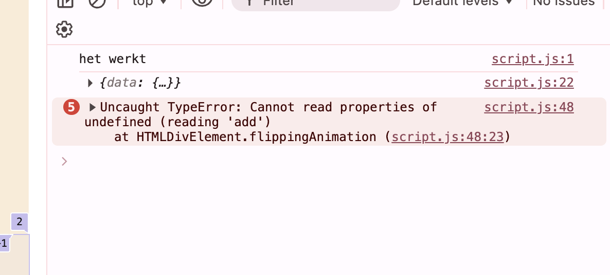

Ik kwam erachter dat er toch nog een foutje in stond in de geschreven code, dus dat had ik aangepast en toen kreeg ik geen foutcode meer. Nu was alleen het probleem nog dat ik de volgende pagina moest selecteren om vervolgend die om te laten kunnen slaan. Dus ik heb onderzoek gedaan naar hoe dat het beste kon en ik kwam uit op een element:  doublePage = doublePage.nextSibling; 
 https://developer.mozilla.org/en-US/docs/Web/API/Node/nextSibling  

 Dit had ik er als volgt ingezet 
 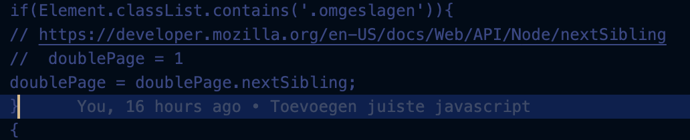

Alleen dit werkte nog niet en ik kon niet achterhalen wat de fout daarin was, plus de pagina's van mijn boek die stonden verkeerd. Dus dat was ook nog eens een probleem waar ik tegenaan liep. 
Na tijd te hebben besteed aan het onderzoeken, kwam ik er weer niet uit en heb ik weer om hulp gevraagd.

Ik merk toch echt dat javascript andere koek is en dat het nog best wel pittig is. 

Uiteindelijk na enige moeite en veel hulp is het gelukt en is het het volgende geworden. 
 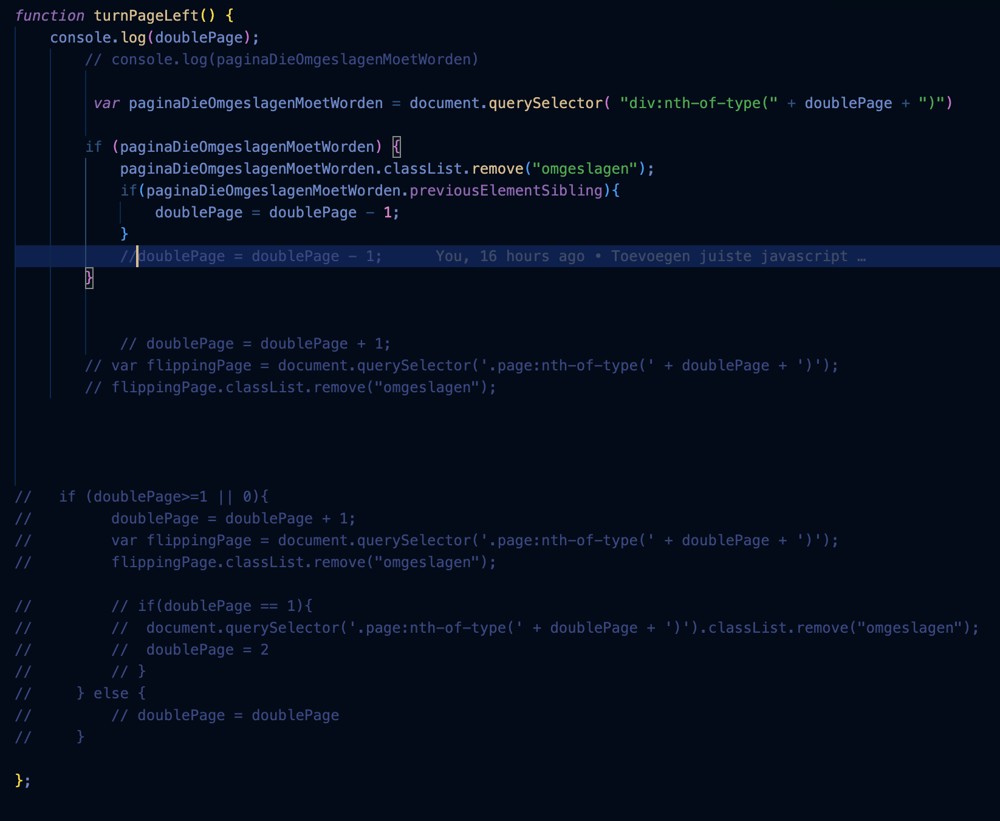

## Daily checkout 2: 5 februari 

### Wat heb ik vandaag gedaan?
Vandaag ben ik bezig geweest met:
- workshop van Sanne over theming
- Mijn boek op de website flipbaar maken
- Onderzoek gedaan naar hoe ik een svg kan toevoegen aan mijn html

### Hoe lang duurde het?
09:30 gedag meeting met de hele klas
10:10 - 11:30 workshop Sanne
11:30 - 12:00 github opschonen
12:00 - 13:00 onderzoeken en opstarten van mijn javascript en toevoegen
13:00 - 15:00 Javascript getest en aanpassingen gemaakt en vragen gesteld aan Vasilis 
15:00 - 15:30 Opgezocht over svg's
15:45 - 16:00 Checkout

### Wat heb ik geleerd?
- Geleerd hoe ik een boek met een click eventlistener kan laten werken

### Wat ga ik morgen doen?
- Morgen ben ik van plan om mijn zogezegde paspoort te vullen met afbeeldingen, die afbeeldingen zeggen iets over mijn leerdoelen en mijn hobby's
- En als ik tijd over heb wil ik nog gaan kijken naar de light en dark mode
- En ook alvast wat kleuren opzoeken die ik als pallette wil gebruiken.

## Proces 6 februari
Voor de styling heb ik voor de binnenkant zoiets in gedachten:
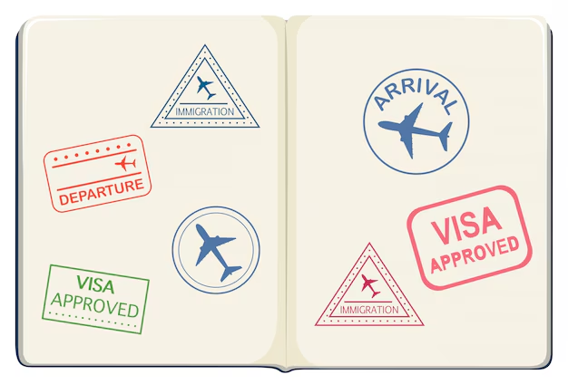

Voor nu gebruik ik tijdelijk algemene afbeeldingen van internet alleen ik wil kijken of het volgende week nog lukt om zelf aan de slag te gaan ermee.

Idee: Voor de stickers op de pagina van de travel, heb ik als idee om de stickers die ik thuis heb in te scannen en die ervoor te gebruiken.

## Weekly checkout week 1
Deze week begon ik naar mijn idee helemaal blanco, ik heb wel al een aantal vakken met code voorgaande jaren gehad, maar na een jaar bijna niet gecodeerd te hebben is het toch wel weer inkomen. 

Deze week ging daarom ook met ups en down, javascript was ik helemaal kwijt. De introductie lessen voorafgaand aan de minor heeft mij in ieder geval geholpen om een api werkend te krijgen.

Ook moet ik zeggen dat ik soms voor mijn idee wat te lang bij een probleem bleef hangen, waardoor het meer tijd kostte dan gewoonlijk, daar kan ik misschien volgende week ook wat meer op gaan letten.

Als ik nu terug kijk op wat ik allemaal heb gedaan is het best wel veel en had ik dit niet vooraf kunnen bedenken. Ik heb geleerd hoe ik een function moet schrijven voor het omslaan van een boek, ik heb geleerd hoe ik eventuele scroll-animations kan maken, hoe je een pagina light-dark thema geeft en tevens ook hoe je ingevoegde html via javascript kan bewerken met css. Ook heb ik verschillende dingen geleerde over preserve-3d en dat dat dan ook iets in perspectief kan zetten.

Ik ben blij met waar ik het deze week naartoe gewerkt heb en ben trots op het resultaat wat ik nu heb staan.

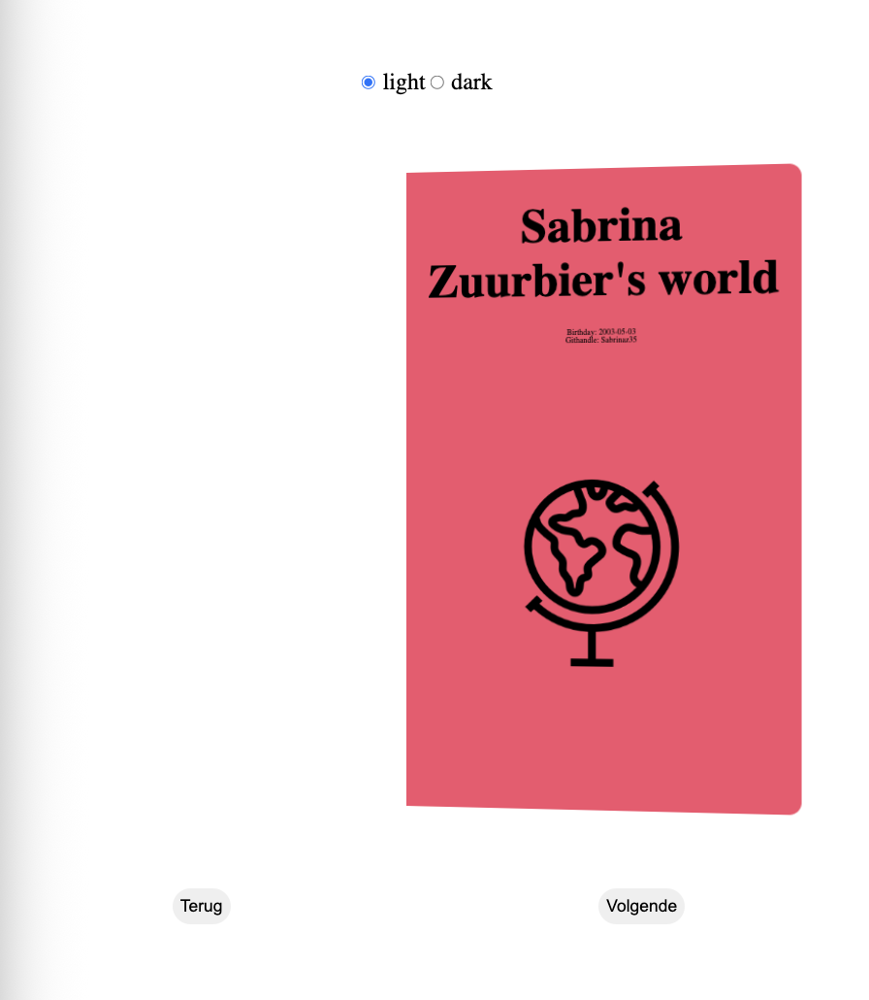

Volgende week wil ik mij meer gaan focussen op visueel vlak en mijzelf daarop nog uitdagen en kijken hoe ik de kleuren van light-dark wat mooier en voor beide pagina's aantrekkelijk kan maken. En daarbij ook wat dieper in de css duiken.

Uiteindelijk heb ik wel al kunnen werken aan mijn leerdoelen, die van javascript is zeker gelukt, want ik heb code geschreven di ik eerst niet snapte, maar nu uiteindelijk wel. Css is opzich nog niet helemaal gelukt en mijn samenwerkingsleerdoel dat gaat nu ook niet helemaal, omdat dit een zelfstandig deel is.

## Daily checkout 3: 9 februari 
Vandaag was ik niet aanwezig op school, ik heb het hele weekend ziek op bed gelegen en bleef nog een dagje thuis. Ik voelde mij wel al wat beter en heb daarom een paar dingetjes kunnen doen aan mijn website.

### Wat heb ik vandaag gedaan?
- Ik heb wat design stickers gemaakt via illustrator, ik heb geprobeerd om dit via svg's erin te zetten alleen dan kwamen de gemaakte ribbetjes niet mee die ze nu wel hebben. 
- Een poging gedaan om de extra eis toe te voegen aan de website, dit is niet gelukt
- Font proberen te veranderen ook dit werkte niet, maar ik heb binnenkort een workshop over typografie misschien dat dat daarbij helpt.
-Verder een beetje layout aangepast naar wens en alvast wat gekeken naar hoe het scherm eruit komt te zien op groot scherm om het responsive te maken.

### Hoe lang duurde het?
Ik ben met de typografie en de api over die extra eis vrij kort mee bezig geweest ik denk ruim een half uur, en met de rest ben ik wel twee a drie uurtjes bezig geweest.

### Wat heb ik geleerd?
Ik merk dat nu ik steeds meer bezig ben met die layout grid dat ik daar steeds makkelijker mee om kan gaan en dat ik daar nu behendiger in begin te worden.

### Wat ga ik morgen doen?
Morgen als ik op school ben wil ik:
- De extra eis fixen
- kijken naar de algehele stijl en die aanpassen(voorkant boekje, misschien achtergrond) en des noods om hulp vragen bij andere daarvoor
- Mijn typografie aangepast hebben en de laatste pagina met favorieten moet ik nog opvullen.
- Als ik nog tijd over heb wil ik kijken of er nog ruimte is om animaties toe te voegen aan verschillende elementen.

## Proces 10 februari
Vandaag ben ik verder gegaan aan mijn code en heb ik de api werkend gekregen.

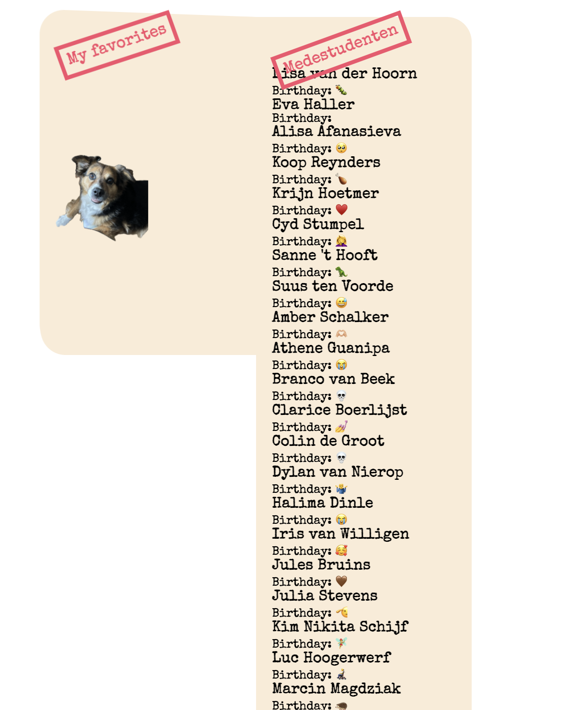

Uiteindelijk was dat gelukt, alleen wilde ik nog een functie erin hebben waarin er steeds andere mede web kandidaten tevoorschijn zou komen. Dit werkte in eerste instantie ook niet echt. Ik heb verschillende dingen geprobeerd, ik heb dit keer zelfs chatgpt gevraagd, maar daardoor snapte ik het ook niet meer. Dus ben ik toch weer naar Vasilis gegaan.

Want ik kreeg de elementen wel in eerste instantie, maar door de mathrandom brak het het weer en kreeg ik een error 400 code vanuit de api.
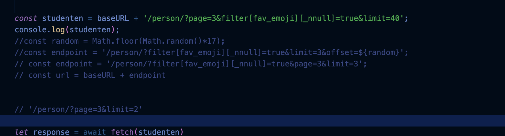

## daily chackout 4: 10 februari
### Wat heb ik vandaag gedaan?
- Een workshop gehad over typografie, waarin ik heb geleerd dat een breedte van 20/40em de juiste breedte zijn voor het lezen.
- Ik heb verder gewerkt aan de extra eis, dit ging niet zonder slag of stoot. Ik wilde een math.random eraan toevoegen alleen dit was toch lastiger dan gedacht.
- Ik heb een typewriter font toegevoegd aan mijn code
- Ik heb wat kunnen spelen met animaties. 
-En de laatste layouts gedefinieerd en toegevoegd.

### Hoe lang duurde het?
09:30 - 10:00 Intro praatje 
10:00 - 11:00 workshop typografie 
11:00 - 11:30 gewerkt aan gradient
11:30 - 12:00 typografie
12:00 - 12:30 pauze
12:30 - 14:30 api/extra eis gefixt
14:30 - 15:00 layouts toegevoegd van de overige pagina's
15:00 - 15:45 Gespeeld en geprobeerd met animaties

### Wat heb ik geleerd?
Ik heb geleerd hoe ik op een juiste manier de mathrandom voor elkaar krijg in de api, dit was best lastig en zal nog wel vaker nodig hebben om door te hebben hoe dit werkt, maar het begin is er.
Ook heb ik wat tips en trick geleerd over typografie, waar ik nooit meer aan had gedacht.

### Wat ga ik morgen doen?
- Beetje de puntjes op de i zetten
- Feedback vragen
- Begin plaatje aanpassen
- Misschien andere gradient kleur
- nog wat animaties toevoegen.

### Code review 11 februari
Tijdens de code review hebben Jelle en ik samen gekeken naar de verschillende aspecten en er stonden voor mij ook wat nieuwe dingen tussen. 
Zoals kebabcase and camelcase, kebabcase is met een streepje ertussen kebab-case en camelcase is waarbij het volgende wordt begint met een hoofdletter camelCase. Uiteindelijk moet ik nog een aantal dingetjes aanpassen:
- toevoegen van extra comments in mijn css over wat wat
- js iets meer opschonen
- line-height aanpassen en de lettergrootte iets groter 
    font-size: 13px;
    line-height: 1.5; 

## daily chackout 5: 11 februari
### Wat heb ik vandaag gedaan?
Vandaag heb ik de puntjes op de I gezet. Ik heb de gradient wel zo gelaten, maar ben mij wat meer gaan focussen op de animaties die ik nog eventueel kon toevoegen.
Uiteindelijk heb ik er ook nog een easter egg in gegooid, waar je als je alleen overeen hovert de button kan vinden voor een disco modus.

### Hoe lang duurde het?
09:30 - 10:00 Intro praatje 
10:00 - 11:00 code review
11:00 - 11:30 gewerkt aan animatie van de svg op de voorpagina
11:30 - 12:00 gewerkt aan de animatie van de postzegels
12:00 - 12:30 pauze
12:30 - 14:30 de easter egg toegevoegd 
14:30 - 15:00 Een animatie op de laatste pagina toegevoegd bij mijn hond, want mijn hond kan niet stilzitten, dus ook niet op het scherm.
15:00 - 15:45 Gespeeld en geprobeerd met animaties

### Wat heb ik geleerd?
- Ik heb geleerd een animatie te maken met een svg, hij is een beetje cracky maar wel coool.
- Ik heb geleerd hoe je een svg als path in je code krijgt, dit moest ik even aan een mede student vragen, maar als je de afbeelding via de texteditor opent dan krijg je de code van de path etc. 

### Wat ga ik morgen doen?
- Morgen is de deadline, dus eigenlijk gewoon nog even mijn code misschien doornemen en that's it voor dit vak.
- Ik heb nog even de buttons uit de footer gehaald en ervoor gezorgt dat die in de main staan, want het was een rare plek om ze in de footer te hebben staan.  

## Weekly reflectie 11 februari
In deze week heb ik flinke stappen gezet zelf. Ik ben het meeste trots op de animatie van de svg en hoe uiteindelijk de look van mijn boekje is geworden. Ik ben blij met wat ik neer heb kunnen zetten in zo'n korte tijd. Maar ik ben wel weer meteen achter een nieuw leerdoel gekomen en dat is. Vooraf een design maken en dan pas gaan werken aan de code, nu was ik namelijk nog best wel zoekende in hoe ik het eruit wilde laten zien.

### Finished product
Hieronder zie je de verschillende pagina's die ik heb gemaakt.

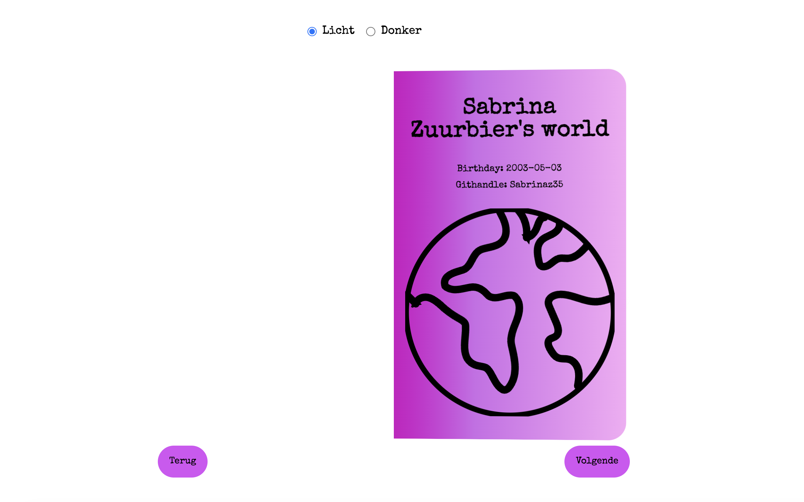
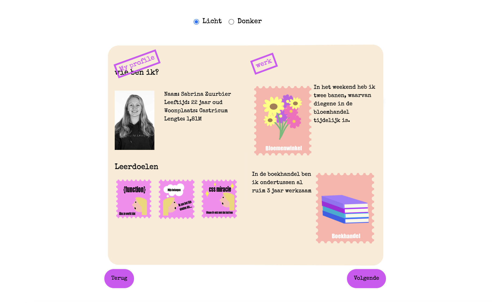
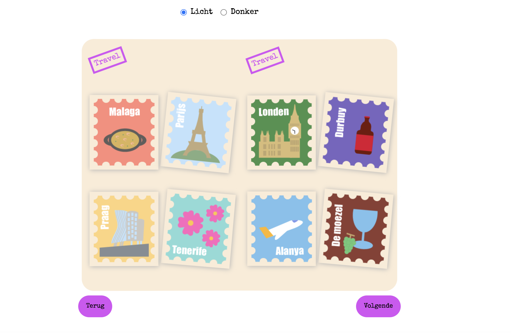
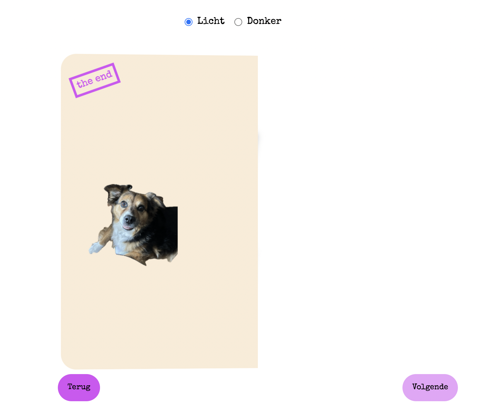

### Geschreven code
Als laatste puntje kreeg ik mee dat in de footer iets losstaands is en dat de buttons die ik er als eerst in had gedaan, dat die horen bij de main, dus dat heb ik nog even aangepast.
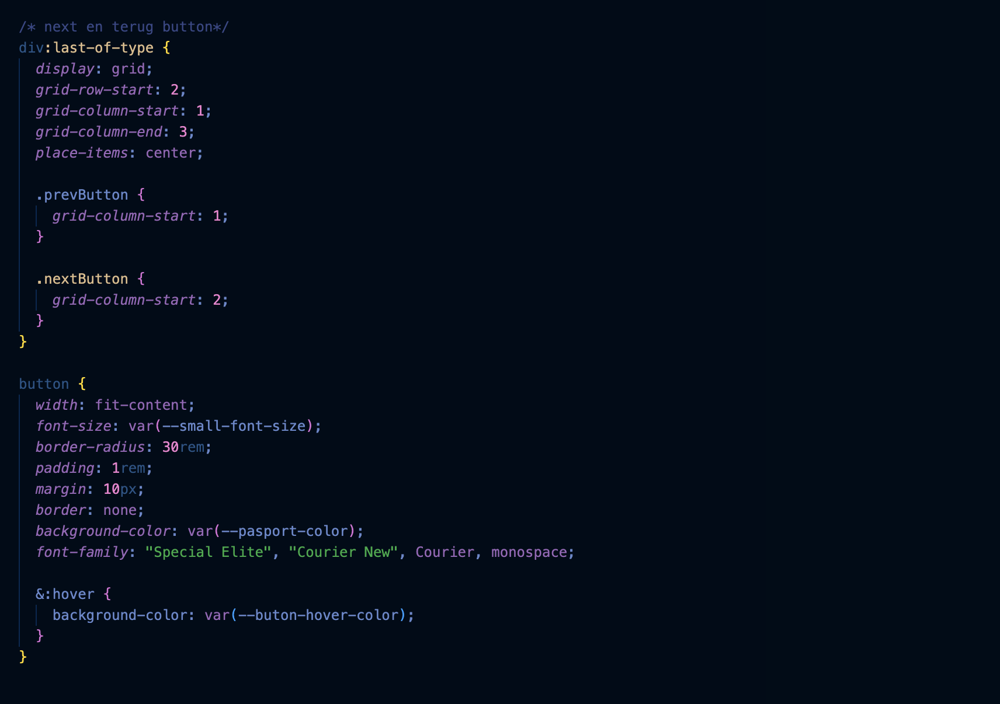

 ## Bronvermelding
 Voor de .classlist

 https://stackoverflow.com/questions/76157470/is-there-a-way-to-animate-a-button-on-click-with-classlist-add 

 https://www.geeksforgeeks.org/javascript/how-to-make-animated-click-effect-using-html-css-and-javascript/

 https://blanken5.home.xs4all.nl/CSS_JS_animatie.html#:~:text=We%20gebruiken%20script%20voor%20de%20timing%20van,2%20seconde%20nadat%20de%20pagina%20is%20geladen. 

 https://developer.mozilla.org/en-US/docs/Web/HTML/Reference/Elements/figure 

 ### svg & afbeeldingen

Alle afbeeldingen so far zijn zelf gemaakt. 

Voor het genereren van de gradient. 
https://cssgradient.io/

### Voor javascript
https://developer.mozilla.org/en-US/docs/Web/JavaScript/Guide/Expressions_and_operators 

https://www.javascripttutorial.net/dom/css/check-if-an-element-contains-a-class/ 

https://developer.mozilla.org/en-US/docs/Web/API/Node/nextSibling 

 Bron: Chatgpt
 Prompt: const endpoint = '/person/?filter[fav_emoji][_nnull]=true?limit=3/' + Math.floor(Math.random()*100) + 1; Klopt dit wat ik hier doe? In mijn code werkt het namelijk niet
 https://chatgpt.com/share/698b157b-f1b0-8001-a6ee-c56649d07fa8 

### fonts
https://fonts.google.com/selection/embed  

### Animaties 
https://www.youtube.com/watch?v=dRloFvC7g6I  
https://css-tricks.com/almanac/properties/s/stroke-dasharray/ 
https://css-tricks.com/almanac/properties/s/stroke-dashoffset/